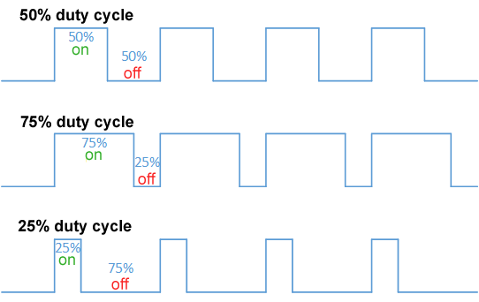

 [](logo-id)

# DAC: digitaal naar analoog[](title-id)

### Inhoud[](toc-id)

- [DAC: digitaal naar analoog](#dac-digitaal-naar-analoog)
    - [Inhoud](#inhoud)
  - [Een introductie](#een-introductie)
  - [PWM](#pwm)
  - [Dyty cycle](#dyty-cycle)
  - [Titan Silent Fan TFD-8015HH12ZP/W1](#titan-silent-fan-tfd-8015hh12zpw1)
  - [De schakeling](#de-schakeling)
  - [Arduino voorbeeld code](#arduino-voorbeeld-code)
  - [Referenties](#referenties)

---

**v0.1.0 [](version-id)** Start document voor digitaal naar analoog door Marius Versteegen[](author-id) en Jorn Bunk[](author-id).

---

## Een introductie

*Digital-to-Analog Converters* (DAC) hebben net als ADC’s een beperking met betrekking tot de resolutie van het signaal. Afhankelijk van hoeveel bits ze als input hebben kunnen ze een hoeveelheid verschillende analoge signalen maken. Er zijn verschillende types van *Digital-to-Analog Converters*  (DAC). We gaan hier in op *Pulse Width Modulation*  (PWM), omdat dit een techniek is die je als Technische Informaticus nog wel eens zal implementeren. Naast PWM zijn er ook andere type DAC’s.

## PWM

Bij PWM is de output niet direct een analoog signaal. Iets wat andere DAC wel produceren In plaats daarvan stuurt PWM pulsen van digitale signalen. Door deze in lengte te variëren staat er “gemiddeld” een bepaalde analoge waarde op een draad. 

## Dyty cycle

De lengte van de digitale signalen drukken we bij PWM uit in *duty cycle*. De duty cycle beschrijft hoe de verhouding is van hoe lang het signaal hoog is en hoe lang het signaal laag is.



In bovenstaand figuur zien we drie voorbeelden van duty cycle. PWM is makkelijk zelf te implementeren door snel, in de juiste verhouding, een pin een hoog signaal en daarna weer een laag signaal te laten sturen. Het nadeel hiervan is dat microcontroller dan ondertussen geen andere taken kan uitvoeren. Gelukkig is hier ook specifieke hardware (zoals de TL5002) voor. Op de meeste Arduino’s zijn enkele pins uitgerust met PWM. Voor de meeste Arduino’s zijn dat pin 3, 5, 6, 9, 10 en 11. PWM is erg handig als je bijvoorbeeld een elektromotor of servo wil aansturen.

    PWM wordt al heel lang gebruikt voor het aansturen van computer ventilatoren die nodig zijn om te koelen. Omdat het voltage niet hoeft worden aangepast maar omdat een PWM signaal wordt gestuurd kunnen moederborden goedkoper gemaakt worden (geen extra voltage regulators nodig).

## Titan Silent Fan TFD-8015HH12ZP/W1

Om voor koeling te zorgen maken we gebruik van de Titan Fan. Deze werkt op 12V maar dat kan een Arduino niet leveren. Een externe voeding is daarom een aanrader.

## De schakeling


De Titan Silent Fan heeft een Four-pin Molex aansluiting met de volgende aansluitingen:
1) Blauw voor PWM signaal 5V, 25kHz
2) Geel voor Sense (het meten van het aantal RPM)
3) Rood voor 12V
4) Zwart voor GND

## Arduino voorbeeld code

```arduino
int fan = 6;           // the PWM pin
int speed = 0;         // speed of the fan
int fadeSpeed = 5;     // how many points to fade the speed by

void setup() {
  pinMode(fan, OUTPUT); // declare pwm pin to be an output:
}

void loop() {
  analogWrite(fan, speed); // set the speed of fan

  // change the speed for next time through the loop:
  speed = speed + fadeSpeed;

  // reverse the direction of the fading at the ends of the fade:
  if (speed <= 0 || speed >= 255) {
    fadeSpeed = -fadeSpeed;
  }  
  delay(300);  // wait for 300 milliseconds to see the fade effect
}
```
[Arduino bestand](../DAC/files/PWM/PWM.ino) 

## Referenties

- Analoog en digitaal (<https://en.wikipedia.org/wiki/Analogue_electronics#Analogue_vs_digital_electronics>)
- Pulse-width modulation (<https://en.wikipedia.org/wiki/Pulse-width_modulation>)
- Arduino PWM (<https://docs.arduino.cc/tutorials/generic/secrets-of-arduino-pwm>)