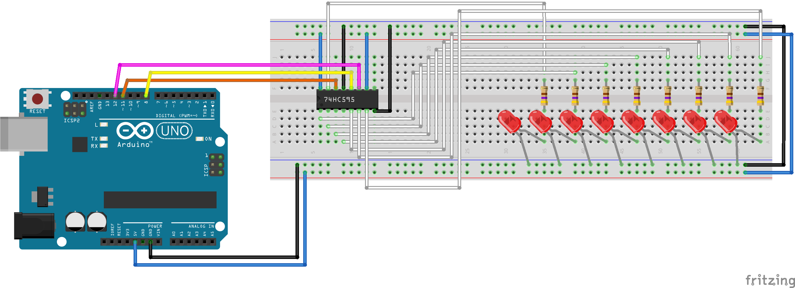

 [](logo-id)

# HC595 Integrated Circuit (IC)[](title-id)

### Inhoud[](toc-id)

- [HC595 Integrated Circuit (IC)](#hc595-integrated-circuit-ic)
    - [Inhoud](#inhoud)
  - [Een introductie](#een-introductie)
  - [De schakeling](#de-schakeling)
  - [Arduino voorbeeld](#arduino-voorbeeld)
  - [Referenties](#referenties)

---

**v0.1.0 [](version-id)** Start document voor HC595 IC door HU IICT[](author-id).

---

## Een introductie

Een (output) schuifregister is een chip waar je stap voor stap bitjes in kan schuiven. Het schuifregister heeft een aantal ‘stages’ achter elkaar, in het onderstaande plaatje. 


Alle stages zijn verbonden met een gemeenschappelijk klok signaal. Als dit kloksignaal verandert van laag naar hoog neemt iedere stage de waarde van de voorgaande over, en de eerste neemt de waarde op zijn ingang over. Hiermee kan je (in 4 stappen) de 4 stages ieder in een door jou gewenste toestand (hoog of laag) brengen. De uitgangen van de schuifregister stages (Q1 t/m Q4) kan je gebruiken als uitgangspinnen, bv. om LEDs aan te sturen. Met een schuifregister van 4 stages kan je zo 4 LEDs aansturen. Om een schuifregister op deze wijze aan te sturen zijn maar 2 GPIO pinnen nodig, ongeacht het aantal stages. Dit is handig als je meer uitgangen wil hebben dan je GPIOs ter beschikking hebt, of als je LEDs op afstand van je microcontroller zitten, en je het aantal draadjes naar de LEDs wil beperken.


    74HC595 schuifregister is geen SPI device we gebruiken SPI alleen om een 'bitstream' te genereren


## De schakeling

De 74HC595 chip is een veelgebruikt 8-stage (output) schuifregister. We gaan deze chip gebruiken om 8 LEDs aan te sturen.

Deze chip heeft behalve 8 schuifregister stages ook nog een opslag (‘holding’ of ‘latch’) register waarin de 8 bitjes opgeslagen worden, zodat het schuiven niet zichtbaar is op de uitgangspinnen.


Om 8 waarden op de uitgangspinnen van een 74HC595 chip te krijgen moeten we dus het volgende doen:

    1) Doe dit 8 keer:
    - Maak de data (shift) ingang van de HC595 gelijk aan de waarde van het hoogste (achtste) bitje van de value (want het eerste bitje dat je aanbiedt wordt het verst doorgeschoven)
    - Maak de shift clock ingang van de HC595 hoog, en daarna meteen weer laag
    - Schuif de bitjes in de value 1 stapje naar links (dit kan je doen door te vermeningvuldigen met een geschikte waarde)
    2) Maak de de holding / latch clock ingang hoog en meteen weer laag 
    3) (om het effect te laten zien moet je nu wachten)


De 74HC595 schuifregister heeft drie ingangen die aan de micro-controller moeten worden aangesloten: shift-clock (SHCP = SHift Clock Pulse), data (DS), en hold-clock (STCP = STorage Clock Pulse). Verder moet je natuurlijk GND en VCC (3.3V) aansluiten, en MR (Master Reclear) aan VCC en OE (Output Enable) aan GND.


We kunnen de 8 LEDs direct aansluiten op de HC595 om een 8 bit binair getal voor te stellen. De anode kant naar de IC (Q0-Q7) en de kathode kant naar ground. Dit heet sourcing current in tegenstelling tot sinking current wanneer een schuifregister geen spanning kan leveren.



## Arduino voorbeeld

Dit is een software implementatie. Gebruik de SPI bibliotheek voor een hardware implementatie.

```arduino
int latchPin = 8;
int clockPin = 12;
int dataPin = 11;
// anyNumber < 256, decimal 123 is binary 01111011
int anyNumber = 123; 

void setup() {
  //set pins to output
  pinMode(latchPin, OUTPUT);
  pinMode(clockPin, OUTPUT);
  pinMode(dataPin, OUTPUT);
}

void loop() {
  // latchPin low, LEDs do not turn on while sending bits
  digitalWrite(latchPin, LOW);
  // shift out the bits
  shiftOut(dataPin, clockPin, MSBFIRST, anyNumber);
  //take the latch pin high, LEDs turn on
  digitalWrite(latchPin, HIGH);
}
```

## Referenties

- Shift register (<https://en.wikipedia.org/wiki/Shift_register>)
- Datasheet (<https://www.ti.com/lit/ds/symlink/cd74hc595.pdf>)
- Serial to Parallel Shifting-Out with a 74HC595 (<https://docs.arduino.cc/tutorials/communication/guide-to-shift-out>)