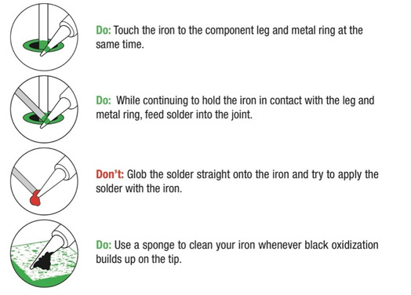
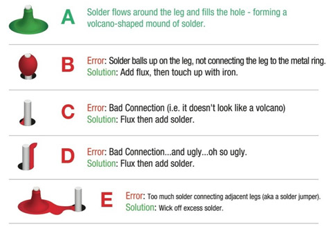

 

# Solderen

### Inhoud

- [Solderen](#solderen)
    - [Inhoud](#inhoud)
  - [Een introductie](#een-introductie)
  - [Tools](#tools)
      - [Soldeerbout](#soldeerbout)
      - [Tin](#tin)
      - [Flux](#flux)
      - [Afzuiging](#afzuiging)
  - [Extra tools](#extra-tools)
      - [Solder wick \& Soldeerzuiger](#solder-wick--soldeerzuiger)
      - [Sponsjes](#sponsjes)
      - [3e hand \& Loep](#3e-hand--loep)
  - [Tips](#tips)
      - [Soldeer tips](#soldeer-tips)
      - [Soldeerverbinding](#soldeerverbinding)
      - [Sweetspot](#sweetspot)
  - [Instructies](#instructies)

---

**v0.1.1 ** Start document solderen door Brian van der Bijl. Aanpassingen en Markdown door Harm Snippe.

---

## Een introductie

Op het moment dat je een project gemaakt op een breadboard permanent wil maken,
zul je moeten gaan solderen. Ook het verwijderen en toevoegen van
pinnen, het toevoegen van bedrading, of het maken van een breakout (een
adapter voor een chip zodat je deze kan gebruiken op een breadboard) zul
je moeten doen door te solderen.

## Tools

Voor het solderen heb je verschillende dingen nodig:

#### Soldeerbout

Op het lab zijn soldeerbouten aanwezig. Let goed op dat je
de juiste soldeerbout kiest voor de juiste tin. Op het moment dat je
de soldeerbout aanzet duurt het een tijdje voordat de soldeerbout opgewarmd is.
Dit kan je testen door een beetje tin tegen de punt aan te houden. Smelt
de tin dan is de soldeerbout klaar voor gebruik.

#### Tin

Op het lab zijn 2 verschillende soorten tin aanwezig. Loodvrij en met
lood. Lood tin heeft een lagere smelt temperatuur en vloeit makkelijker.
Loodvrij tin is beter voor je gezondheid en het vloeien kan verbeterd
worden met flux.

#### Flux

Flux is een stof die er voor zorgt dat de oxidatielaag (roest) op het
metaal verwijderd wordt, waardoor de soldeertin beter kan vloeien en
hechten. Smeer een klein beetje flux met het kwastje op de
aanhechtingspunten. Veeg na het gebruik de resten flux van de PCB af.

#### Afzuiging

Bij het solderen komen schadelijke dampen vrij. Gebruik hierom ALTIJD de
afzuiging en plaats deze circa 10cm boven het project.

## Extra tools

#### Solder wick & Soldeerzuiger

Deze tools kunnen gebruikt worden om tin weg te halen. Solder wick
gebruik je door het op de tin te leggen en dan warm te maken met de
soldeerbout. Zodra de tin gesmolten is haal je de wick er af. De tin
blijft hier aan plakken. Om de zuiger te gebruiken, maak je de tin eerst
vloeibaar (met de soldeerbout), vervolgens houd je de zuiger bij de tin
en druk je op de knop. De tin wordt dan opgezogen. We hebben ook een desoldering iron.

#### Sponsjes

Bij de soldeerbout liggen verschillende sponsjes (metalen en natuurlijke
varianten). Gebruik deze om overtollig soldeertin van je soldeerbout af
te halen. Als je een natuurlijke spons gebruikt moet je er voor zorgen
dat deze nat is. Gebruik daar gedemineraliseerd water voor.

#### 3e hand & Loep

Een 3e hand kan gebruikt worden om je project vast te houden, dit houdt
je werk en componenten stabiel. De loep kan je gebruiken om kleine
details te zien tijdens het solderen of om je connectie te controleren

## Tips

#### Soldeer tips 

Neem de volgende tips in acht bij het solderen.

Figuur 1. Do and do not.

#### Soldeerverbinding 

Wat is een goede soldeerverbinding.

Figuur 2. Soldeerverbinding.

#### Sweetspot 

Sweetspot van een soldeerbout.

Figuur 3. Sweetspot van de soldeerbout.

## Instructies

1.  Lees deze instructies volledig door.

2.  Plaats het component op de juiste manier op / in het PCB.

3.  Als je flux wilt gebruiken smeer dat nu op de pad.

4.  Maak de tip van de soldeerbout schoon.

5.  Warm de pad op de PCB en de pin van het component op met de
    sweetspot van de soldeerbout [Figuur 3](#soldeer-tips), voor 1 seconden.

6.  Voeg, terwijl je de soldeerbout er op blijft houden, langzaam een
    klein beetje tin toe. De tin moet op de pad vast smelten.

7.  Haal de tin-draad weg en hou de bout nog 1 seconde op de joint.

8.  Haal de soldeerbout weg en check de joint met [Figuur 2](#soldeer-tips).

9.  Is alles gesoldeerd, zet dan de soldeerbout uit. Als je met lood
    hebt gesoldeerd was dan ook je handen.
