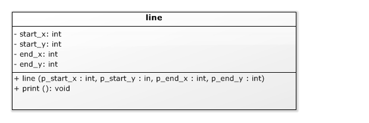

# Compositie - classes [](title-id)

### Inhoud[](toc-id)
- [Compositie - classes ](#compositie---classes-)
    - [Inhoud](#inhoud)
  - [Introductie](#introductie)
    - [Voorkennis en leeswijzer](#voorkennis-en-leeswijzer)
  - [Class vs. struct](#class-vs-struct)
    - [Private vs. public](#private-vs-public)
  - [OO programmeren](#oo-programmeren)
    - [Public en private (class)](#public-en-private-class)
      - [Voordelen afscherming (private)](#voordelen-afscherming-private)
    - [UML](#uml)
      - [Voorbeeld: line class](#voorbeeld-line-class)


---

**v0.1.0 [](version-id)** Start document voor OO programming concepten C++ door HU IICT[](author-id).

---

## Introductie

### Voorkennis en leeswijzer
Onderstaande informatie gaat ervan uit dat je kennis hebt genomen van [Compositie - structs](../structs/README.md).

## Class vs. struct
Het combineren van data en functies in een `struct` is legaal C++, maar wordt zelden gebruikt, omdat er in C++ een alternatief is voor struct: `class`. 

### Private vs. public
Het enige verschil tussen struct en class is dat de default permissies (als je zelf niets aangeeft) bij een struct public is, en bij een class private. 

## OO programmeren
Het is een ingeburgerde (en daardoor aan te raden) gewoonte om class te gebruiken in plaats van struct als je onderdelen private maakt en/of functies binnen de class plaatst.

Deze vorm van programmeren wordt Object Oriented (OO) genoemd: er wordt niet gebruik gemaakt van losse gegevens en functies maar
- de gegevens en de daarbij behorende functies worden gecombineerd in een **klasse (class)**, 
- het programma maakt gebruik van **objecten** (instanties van klassen) die ieder van een bepaalde (type) klasse zijn. 

### Public en private (class)
Een klasse: 
- biedt zijn gebruikers *toegang* tot bepaalde functies en data onderdelen (het publieke deel), maar 
- schermt andere onderdelen af (het privé deel). 

#### Voordelen afscherming (private)
Een belangrijk voordeel van afscherming is dat het privé deel gewijzigd kan worden zonder dat de rest van de applicatie hier iets van merkt. 
Voorbeeld:
In ons geval zouden we bv. de coördinaten van een klein LCD scherm kunnen opslaan als `unsigned char` om ruimte te besparen, of in een ander geval als `doubles` als dat voor onze grafische processor beter uitkomt.

### UML
In UML geven we een klasse aan als een rechthoek met drie delen: 
- de naam, 
- de data elementen (attributen), en 
- de functies. 
  
Een `-` voor een onderdeel geeft aan dat het onderdeel *private* is (niet voor de buitenwereld zichtbaar), een `+` geeft aan dat het *public* is. 

Het *type* van een attribuut en het *return type* van een functie staan achteraan. 
Een *constructor* herken je aan de naam (gelijk aan de naam van de klasse), en aan het ontbreken van een return type.

#### Voorbeeld: line class
In de line class zijn de attributen (variabelen) private, en de methoden (functies) public. Dit is de meest voorkomende situatie (zeker voor eenvoudige klassen), maar private functies en (in mindere mate) public variabelen komen ook voor.


*Image 1 - UML diagram van de lijn klasse*

```c++
class line {
private:
  int start_x;
  int start_y;
  int end_x;
  int end_y;
public:
  line( int p_start_x, int p_start_y, int p_end_x, int p_end_y );
  void print();
};
```
*Codevoorbeeld 04-06 - C++ declaratie van de lijn klasse*